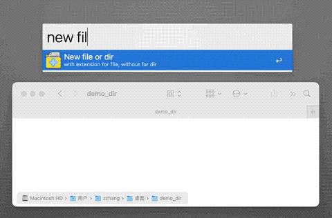
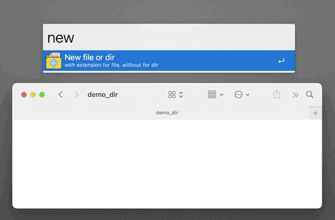
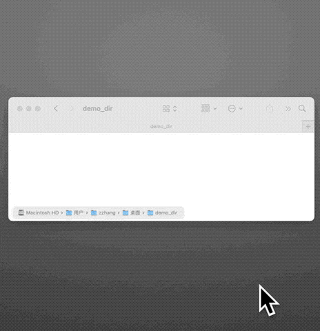
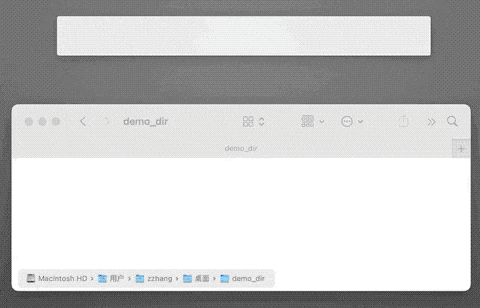
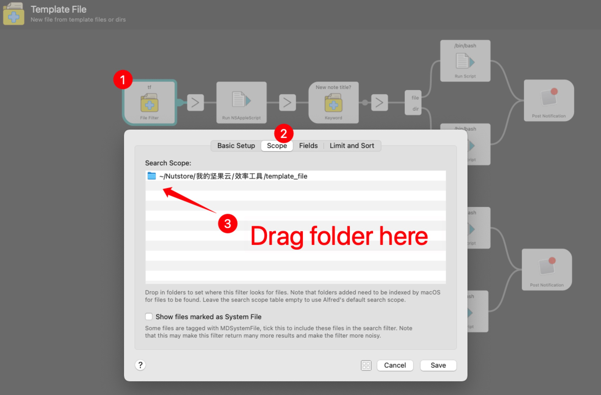

<!-- PROJECT LOGO -->
 

  

  <h2 align="center">Template File</h3>

  

    New <b> any type </b> of file or folder (<b>directly</b> or using a <b>template</b>) with Alfred.
     
    <a href="http://www.packal.org/workflow/template-file"><strong>⏬ Download »</strong></a>
     
  

***
The official repo of the 
[Template File](http://www.packal.org/workflow/template-file).
It can help MacOS users easily create any type of file in the active Finder window.
Now, it works in two ways：

1. Create directly (with keyword `new`)

2. Create from template (with keyword `tf`)

<!-- 1. Directly create a folder or any type of empty file.
2. Create folders or files from template files or folders. -->

## Prerequisites
* macOS
* [Alfred Powerpack](https://www.alfredapp.com/)

<!-- USAGE EXAMPLES -->
## Usage
1. **Initialize the workflow (with keyword `new`)**
    * If you use it for the first time, please 
    initialize by `opentf`. In the future, you can also open the directory where the template file is saved through this command.
2. **Create directly (with keyword `new`)**
    * Directly use the specified ***extension*** to create a new file of the corresponding type, e.g., `new filename.docx`. It supports popular file types, which can be found in `template_file/` (open by `opentf`). You can also add some other custom types in the folder.
    

    * Without expansion, it will directly create folder, e.g., `new dirname`.
    

3. **Create from templates (with keyword `tf`)**
    * Select a template file (like `tf ...`), then enter a filename to create the file.
    I recommend you store your files in `your_templates/` (open by `opentf`)
    

    * Select a template folder (can contains files and subfolders), then enter a dirname to create the folder.
    

## Tips
* If you want change the search scope of the `tf` keyword, you can drag new dir here.

* Follow [真不瓤来](https://space.bilibili.com/184678848) in Bilibili for more interesting tools.

